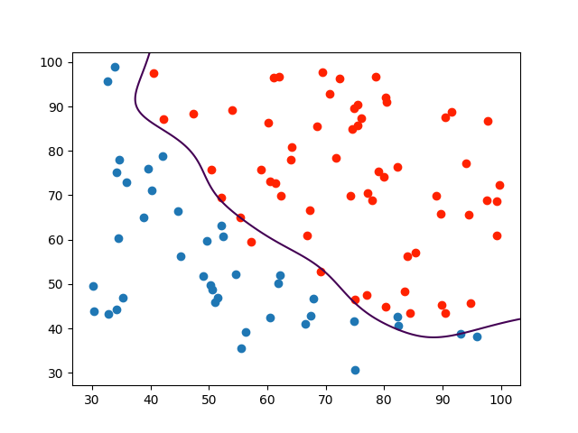

# Sequential Minimal Optimization algotihm for SVM

A SMO class is created for easier debugging and in order to avoid passing all the parameters to every method.
Class variables incude $ \alpha $ vector, $ b $, $ x $ and $ y $ vectors, $ C $ regularization parameter and $ \gamma $ parameter for kernel function


```python
    def __init__(self, x, y, c, gamma):
        self.b = 0
        self.alpha = np.zeros((x.shape[0], 1))
        self.features = x
        self.labels = y.reshape(len(y), 1)
        self.c = c
        self.gamma = gamma
```

SMO is a dual optimization problem stated as:
$$ max_\alpha \quad \quad W(\alpha) \ = \  \sum_{i = 1}^{m}\alpha_i  - \frac{1}{2} \sum_{i = 1}^{m} \sum_{j = 1}^{m} y^{(i)}y^{(j)} \alpha_i \alpha_j \langle x^{(i)}, x^{(j)} \rangle  $$

subject to:
$$ 0 \leq \alpha_i \leq C \quad and \quad \sum_{i = 1}^{m}\alpha_i y^{(i)} = 0 $$

A hypothesis function is given by linear classifier formula :

\begin{equation}
   f(x) = \omega^Tx+b =   \sum_{i=1}^m \alpha_i y^{(i)} \langle x^{(i)}, x \rangle+ b
\end{equation}
 
 So when $ \alpha, X  =  \langle x^{(i)}, x \rangle $ and $y$ are vectors we get:
 $$ \alpha ./  y\cdot  X^T + b $$


```python
    def hypothesis(self, x):
        return np.transpose(np.multiply(self.alpha, self.labels))\
                  .dot(np.array([self.kernel_function(a, x, self.gamma) for a in self.features])
                       .reshape(self.features.shape[0], 1)) + self.b
```

A Gaussian kernel is used given by: $$ \langle x^{(i)}, x^{(j)} \rangle = exp(\frac{|| x_i - x_j ||^2}{-\gamma}) = exp(\frac{\sqrt{(x_i - x_j)^T \cdot (x_i - x_j)}^2}{-\gamma}) = exp(\frac{(x_i - x_j)^T \cdot (x_i - x_j)}{-\gamma}) $$


```python
  def kernel_function(x, z, gamma):
        k = np.transpose(x-z).dot(x-z)/-gamma
        return np.exp(k)
```

After choosing multipliers $ \alpha_i $ and $ \alpha_j $ to optimize we need to compute constrains on them, such that 
$$ L \leq \alpha \leq H $$
in order to satisfy 
$$ 0 \leq \alpha \leq C $$
which are given by :

  if $ \quad y^{(i)} = y^{(j)}, \quad  L = max(0 , \alpha_j +\alpha_i - C), \quad H = min(C, \alpha_j + \alpha_i) $
  
  otherwise $ \quad  L = max(0 , \alpha_j - \alpha_i), \quad H = min(C, C + \alpha_j - \alpha_i) $


```python
 def calculate_constrains(self, i, j):
        # return L, H
        if self.labels[i] == self.labels[j]:
            return max(0.0, float(self.alpha[j] + self.alpha[i] - self.c)), min(self.c, float(self.alpha[j] + self.alpha[i]))
        else:
            return max(0.0, float(self.alpha[j] - self.alpha[i])), min(self.c, float(self.c + self.alpha[j] - self.alpha[i]))
```

Next we want to find $ \alpha_j $ so as to maximize objective function 

Update rule for $ \alpha_j $ is :

$$ \alpha_j \ -= \frac{y^{(j)}(E_i - E_j)}{\eta} $$


We need to calculate errors given by:
$$ E_k = f(x^{(k)}) - y^{(k)}  $$


```python
    def calculate_error(self, i):
        return self.hypothesis(self.features[i]) - self.labels[i]
```

And $ \eta $ given by:
$$ \eta = 2\langle x^{(i)}, x^{(j)} \rangle - \langle x^{(i)}, x^{(i)} \rangle -\langle x^{(j)}, x^{(j)} \rangle $$


```python
 def calculate_eta(self, i, j):
        return 2 * self.kernel_function(self.features[i], self.features[j], self.gamma) \
               - self.kernel_function(self.features[i], self.features[i], self.gamma) -\
               self.kernel_function(self.features[j], self.features[j], self.gamma)
```

Clip $\alpha_j$ to bounds defined above if needed

And finally update $ \alpha_i $ value :
$$ \alpha_i \ += y^{(i)}y^{(j)}(\alpha_j^{(old)} - \alpha_j) $$
where $ \alpha_j^{(old)} $ is a value before optimization


```python
    def update_alpha_j(self, i, j):
        alpha_j_old = self.alpha[j]
        self.alpha[j] -= float(self.labels[j] * (self.calculate_error(i) - self.calculate_error(j))) / float(self.calculate_eta(i,j))
        L, H = self.calculate_constrains(i, j)

        if self.alpha[j] > H:
            self.alpha[j] = H
        elif self.alpha[j] < L:
            self.alpha[j] = L
```

Finally we select the threshold $ b $ such that KKT conditions are satisfied for $ i $ -th and $ j $ -th example

If, after optimization, $ 0 < \alpha_i < C $
then the following threshold $ b_1 $ is valid, since it forces the SVM to output $ y^{(i)}$ when the input is $x^{(i)} $


$$ b_1 = b - E_i -y^{(i)}(\alpha_i - \alpha_i^{(old)}) \langle x^{(i)}, x^{(i)} \rangle -y^{(j)}(\alpha_j - \alpha_j^{(old)}) \langle x^{(i)}, x^{(j)} \rangle $$


Similarly, the following threshold $b_2$ is valid if $ 0 < \alpha_j < C $


$$ b_2 = b - E_j -y^{(i)}(\alpha_i - \alpha_i^{(old)}) \langle x^{(i)}, x^{(j)} \rangle -y^{(j)}(\alpha_j - \alpha_j^{(old)}) \langle x^{(j)}, x^{(i)} \rangle $$


If both $ 0 < \alpha_i < C$ and $ 0 < \alpha_j < C $ then both these thresholds are valid, and they will be equal, so $ b = \frac{(b_1 + b_2)}{2} $ .


```python
    def calculate_b(self, i, j, a_i_old, a_j_old):
        b_1 = self.b - self.calculate_error(i) - self.labels[i] * (self.alpha[i] - a_i_old) * \
              self.kernel_function(self.features[i], self.features[i], self.gamma) - self.labels[j] *\
              (self.alpha[j] - a_j_old) * self.kernel_function(self.features[i], self.features[j], self.gamma)

        b_2 = self.b - self.calculate_error(j) - self.labels[i] * (self.alpha[i] - a_i_old) *\
              self.kernel_function(self.features[i], self.features[j], self.gamma) - self.labels[j] *\
              (self.alpha[j] - a_j_old) * self.kernel_function(self.features[j], self.features[i], self.gamma)
```

Additionally a method for selecting $ \alpha_j $ is needed. The simplest solution is choosing it randomly


```python
    def select_j(self, i):
        random.seed(time.time())
        j = random.randint(0, self.features.shape[0]-1)

        while i == j:
            j = random.randint(0, self.features.shape[0]-1)

        return j
```

Main function train takes tolerance and maximum number of iterations possible without change to $ \alpha $


```python
    def train(self, tol, max_n):
        n = 0
        while n < max_n:
            changed_alphas = 0
            for i in range(self.features.shape[0]):
                E_i = self.calculate_error(i)
                if (self.labels[i] * E_i < -tol and self.alpha[i] < self.c) or\
                        (self.labels[i] * E_i > tol and self.alpha[i] > 0):
                    j = self.select_j(i)
                    old_a_i = self.alpha[i]
                    old_a_j = self.alpha[j]
                    l, h = self.calculate_constrains(i, j)
                    if l == h:
                        continue
                    eta = self.calculate_eta(i, j)
                    if eta > 0:
                        continue
                    self.update_alpha_j(i, j)
                    if abs(self.alpha[j] - old_a_j) < 10 ** -5:
                        continue
                    # update alpha_i
                    self.alpha[i] += self.labels[i] * self.labels[j] * (old_a_j - self.alpha[j])
                    self.calculate_b(i, j, old_a_i, old_a_j)
                    changed_alphas += 1
            if changed_alphas == 0 :
                n += 1
            else:
                n = 0
```

Plot of decision boundary found by algorrithm with parameters : 
$ tol = 0.0000005 \quad max\_iter = 50 \quad C = 0.1 \quad \gamma = 100 \quad $ 
is shown below



SMO algorithm is based on a simplified version overview from http://chubakbidpaa.com/assets/pdf/smo.pdf

